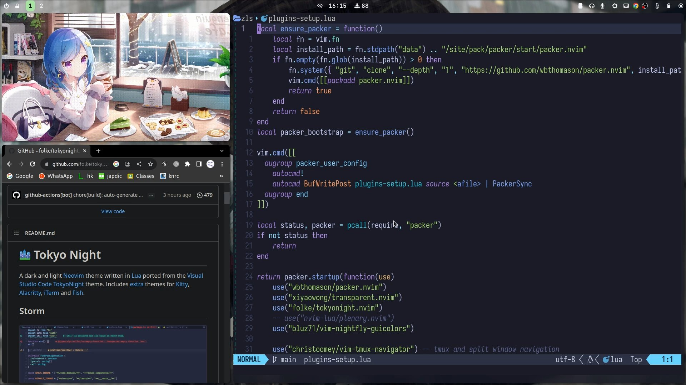

- **Window Manager** • [Hyprland](https://github.com/hyprwm/Hyprland)
- **Terminal** • [Foot](https://github.com/r-c-f/foot) Fast, lightwieght and minimal terminal
- **Wayland Bar** • [Waybar](https://aur.archlinux.org/packages/waybar-hyprland-git)
## 🍀 Screenshots

## Credits

Unixporn: [r/unixporn](https://www.reddit.com/r/unixporn)._

**©** _Developers of all these opensource tools._

